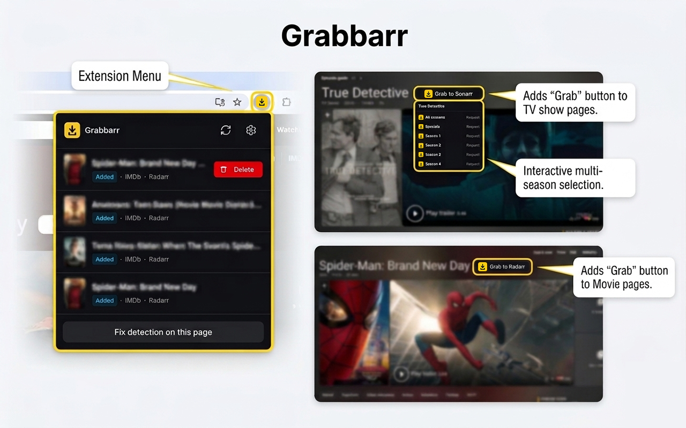

# Grabbarr

A Chromium extension that adds a **Grab** button to movie and TV pages on IMDb,
TMDb, Rotten Tomatoes, and Kinopoisk. One click sends the title to your
self-hosted [Radarr](https://radarr.video/) (movies) or
[Sonarr](https://sonarr.tv/) (TV) instance.



## Features

- **Grab button** injected on supported media pages; movies go to Radarr, TV to Sonarr.
- **Live status** — the button and the popup history show whether a title is in your
  library and its download state (In Radarr/Sonarr, Downloading, Downloaded, …).
- **Remove / unwatch** — a two-click "Remove → Confirm?" undo, on both the page button
  and each history row, in case of an accidental grab.
- **History popup** listing your latest grabs with status, refreshed on open.
- **Resilient detection** — per-site adapters with an Open Graph fallback, plus an
  in-page **element picker** to fix detection yourself when a site changes its layout.
- **Configurable** — pick the default quality profile and root folder per app
  (fetched from the API), and enable/disable individual sites.
- Minimal, framework-free UI built with Vite, TypeScript, and Tailwind.

## Supported sites

IMDb · TMDb · Rotten Tomatoes · Kinopoisk

## Install (load unpacked)

```bash
npm install
npm run build
```

Then in Chrome/Edge: open `chrome://extensions`, enable **Developer mode**, click
**Load unpacked**, and select the generated `dist/` folder.

## Configure

On first install the options page opens automatically (or click the toolbar icon →
gear). For each app you use:

1. Enter the **Server URL** (e.g. `http://localhost:7878` for Radarr,
   `http://localhost:8989` for Sonarr) and **API key** (found under
   *Settings → General* in Radarr/Sonarr).
2. Click **Test connection** — grant the one-time permission prompt for that URL,
   then pick a **quality profile** and **root folder**.
3. Toggle which sites the Grab button appears on, and **Save**.

Your Radarr/Sonarr instances can be at any address; the extension requests host
access for the exact URL you enter rather than a broad permission up front.

## Usage

- Open a movie/show on a supported site and click **Grab to Radarr/Sonarr**.
- Already in your library? The button shows the current status. Hover it and click
  twice (**Remove → Confirm?**) to remove the title (this deletes it and its files
  from the *arr app).
- The toolbar **popup** lists your recent grabs with live status and a per-row remove.
- If the button doesn't appear or reads the wrong title, use **Fix detection on this
  page** in the popup to point at the right elements; the override is saved per site.

## Development

```bash
npm run dev     # Vite dev server with HMR (load dist/ as an unpacked extension)
npm run build   # type-check + production build into dist/
npm run icons   # regenerate PNG icons from public/icon.svg
```

See [CLAUDE.md](./CLAUDE.md) for an overview of the architecture.

## License

[MIT](./LICENSE)
